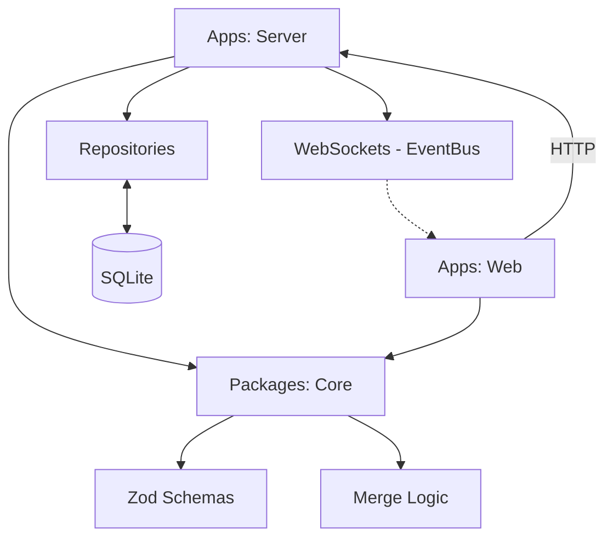

# Architecture Overview

This project is a **pnpm monorepo** established to support the development of a local-first kanban system. Currently, it consists of the foundational workspace configuration and the first shared logic package.

## Current Directory Structure

```text
.
├── apps/                 # Application runtimes
│   ├── server/           # Fastify server + SQLite storage engine
│   └── web/              # React 19 + Vite Kanban frontend
├── packages/             # Shared libraries and internal tools
│   └── core/             # Core domain logic and models
├── .agent/               # Agent-specific documentation and rules
├── .github/              # CI/CD workflows (GitHub Actions)
└── .husky/               # Git hooks for quality gates
```

## Tooling Strategy

We use a unified toolchain to ensure consistency across the monorepo:

- **Package Management:** `pnpm` for workspace management.
- **Linting & Formatting:** `Biome` (v2.3.15) for unified linting and formatting.
  - **Normalization**: Enforces `lineEnding: lf` to ensure CI/CD (Linux) and Local (Windows) agreement.
  - **Optimization**: Problematic nursery rules (`useSortedClasses`) are disabled to prevent Windows-specific instability.
- **TypeScript:** Strict-mode configuration for all packages.
- **Testing:** `Vitest` for unit and integration testing.
  - **Runner:** `node scripts/test-all.js` (custom sequential runner) for Windows stability.

## Current Data Flow

The project currently consists of the **Core** package and the **Server/Web** applications.

- **`packages/core`**: Contains the Zod schemas for `Card`, `Board`, and `Column`, as well as the offline-first **Merge Logic**.
- **`apps/server`**: The local-first backend.
  - **Storage**: SQLite via `@libsql/client`.
  - **API**: Fastify-based REST endpoints for CRUD operations.
  - **Real-time**: WebSocket integration via `EventBus`.
- **`apps/web`**: The Kanban frontend.
  - **Framework**: React 19 + Vite + Tailwind.
  - **Data**: Reactive hooks (`useBoard`) fetching from `apps/server`.



## Quality Management

1. **Local Enforcement:** Husky hooks run `lint-staged` on staged files.
2. **CI Validation:** GitHub Actions runs `lint`, `typecheck`, and `test` on every pull request.
3. **Branch Protection:** Merges to `main` require linear history and successful status checks.
