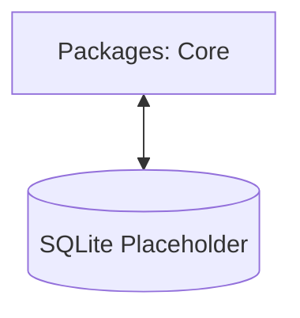

# Architecture Overview

This project is a **pnpm monorepo** established to support the development of a local-first kanban system. Currently, it consists of the foundational workspace configuration and the first shared logic package.

## Current Directory Structure

```text
.
├── packages/             # Shared libraries and internal tools
│   └── core/             # Core domain logic and models
├── .agent/               # Agent-specific documentation and rules
├── .github/              # CI/CD workflows (GitHub Actions)
└── .husky/               # Git hooks for quality gates
```

## Tooling Strategy

We use a unified toolchain to ensure consistency across the monorepo:

- **Package Management:** `pnpm` for workspace management.
- **Linting & Formatting:** `Biome` (v2.3.15) for unified linting and formatting.
- **TypeScript:** Strict-mode configuration for all packages.
- **Testing:** `Vitest` for unit and integration testing.

## Current Data Flow

The project currently consists of the **Core** package. Future runtimes (CLI, Server, MCP) will depend on this package for business logic and data persistence.



## Quality Management

1. **Local Enforcement:** Husky hooks run `lint-staged` on staged files.
2. **CI Validation:** GitHub Actions runs `lint`, `typecheck`, and `test` on every pull request.
3. **Branch Protection:** Merges to `main` require linear history and successful status checks.
