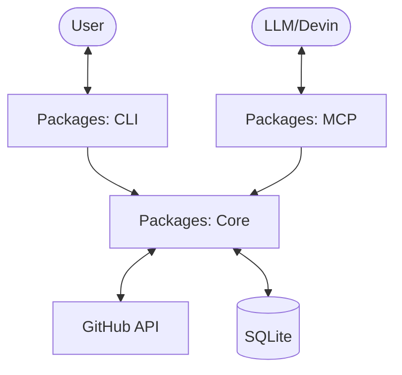

# Architecture Overview

This project is structured as a **pnpm monorepo** to maintain high cohesion between the core logic, CLI interface, and MCP server while keeping them independently deployable.

## Directory Structure

```text
.
├── apps/                 # Future application runtimes (Server, Web)
├── packages/             # Shared libraries and internal tools
│   ├── core/             # Core domain logic, models, and GitHub sync engine
│   └── cli/              # Command line interface (placeholder)
│   └── mcp/              # Model Context Protocol server (placeholder)
├── .agent/               # Agent-specific documentation and rules
├── .github/              # CI/CD workflows (GitHub Actions)
└── .husky/               # Git hooks for quality gates
```

## Tooling Strategy

We prioritize a "Unified Toolchain" approach to minimize configuration drift and maximize developer experience:

- **Package Management:** `pnpm` for fast, disk-efficient workspace management.
- **Linting & Formatting:** `Biome` as a single, high-performance tool for both, replacing the Prettier/ESLint complexity.
- **TypeScript:** Strict-mode project references to ensure type safety across package boundaries.
- **Testing:** `Vitest` for its native ESM support and speed, configured at the workspace root but runnable per package.

## Data Flow (Conceptual)



## Quality Management

1. **Local Enforcement:** Husky hooks run `lint-staged` (Biome + related tests) on every commit.
2. **CI Validation:** Every PR triggers a full `lint`, `typecheck`, and `test` suite in GitHub Actions.
3. **Branch Protection:** Merges to `main` require linear history and successful status checks.
